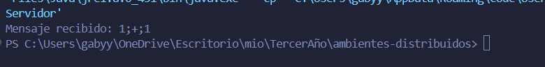
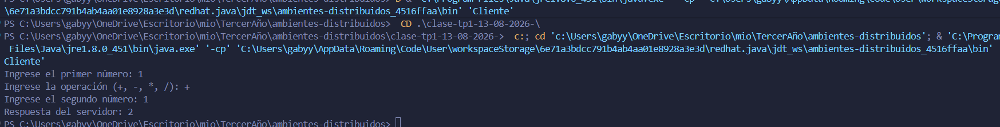
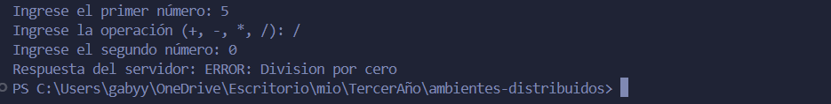

# TP N.º 1 — Calculadora Distribuida con Sockets TCP
* `Alumna` : Gabriela Tamara Sosa

## Descripción

Este proyecto implementa una aplicación **Cliente-Servidor en Java** utilizando sockets TCP y la API `java.net`.

El sistema permite realizar operaciones matemáticas de forma remota. El cliente solicita dos números y una operación, envía los datos al servidor y recibe el resultado calculado.

##  Tecnologías utilizadas

* Java
* `java.net`
* `java.io`
* Sockets TCP

##  Estructura del proyecto

```text
clase-tp1-13-08-2026-/
├── Servidor.java
├── Cliente.java
└── README.md
```

## Funcionamiento

El cliente envía los datos al servidor utilizando el siguiente formato:

```text
numero1;operacion;numero2
```

Por ejemplo:

```text
15;+;30
```

El servidor recibe estos datos, realiza la operación correspondiente y devuelve el resultado al cliente.

### Ejemplo

```text
Cliente → 15;+;30
Servidor → 45
```

También se controla la división por cero:

```text
Cliente → 15;/;0
Servidor → ERROR: Division por cero
```

##  Ejecución

### 1. Iniciar el servidor

Primero se debe ejecutar `Servidor.java`.

El servidor queda esperando conexiones en el puerto:

```text
5500
```

### 2. Ejecutar el cliente

Con el servidor funcionando, ejecutar `Cliente.java`.

El cliente se conecta al servidor mediante:

```text
localhost:5500
```

Luego envía la operación y recibe el resultado.

##  Pruebas realizadas

### Suma

```text
15 + 30 = 45
```

### Resta

```text
30 - 15 = 15
```

### Multiplicación

```text
15 * 30 = 450
```

### División

```text
30 / 15 = 2
```

### División por cero

```text
15 / 0
```

Resultado:

```text
ERROR: Division por cero
```

##  Capturas de pantalla

### Servidor ejecutándose



### Cliente ejecutándose


### División por cero



##  Conclusión

La práctica permitió comprender el funcionamiento básico de una arquitectura Cliente-Servidor y la comunicación entre procesos mediante sockets TCP.

El cliente se encarga de solicitar y enviar los datos, mientras que el servidor recibe la información, realiza la operación matemática y devuelve el resultado.

También se pudo observar el comportamiento del sistema frente a errores, como la división por cero y la imposibilidad de conectarse cuando el servidor no está disponible.
