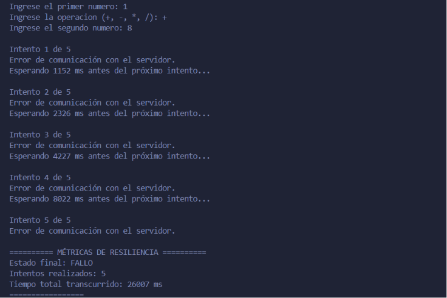
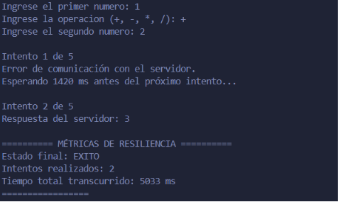
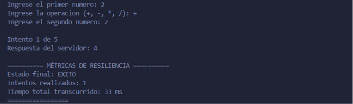

# TP N.º 2 — Resiliencia en Cliente-Servidor

**Alumna:** Gabriela Tamara Sosa

## Descripción

Este trabajo continúa la aplicación Cliente-Servidor desarrollada en el TP N.º 1 utilizando Java y sockets TCP.

Se modificó el cliente para incorporar reintentos mediante **Backoff Exponencial + Jitter** y métricas de resiliencia.

## Tecnologías utilizadas

- Java
- `java.net`
- `java.io`
- Sockets TCP
- `ThreadLocalRandom`

## Estructura del proyecto

```text
TP2/
├── ClienteResiliente.java
├── README.md
├── jitter_fallo.png
├── recuperacion.png
└── metricas.png
Ejercicio 1: Incorporación de Jitter al Cliente

Se modificó la estrategia de espera entre reintentos para incluir Jitter.

La fórmula utilizada es:

TiempoEsperado = (Base × 2^(intento - 1)) + Random(0, 500) ms

Se utilizó:

Base = 1000 ms
Máximo de intentos = 5
Jitter = valor aleatorio entre 0 y 500 ms

El cálculo implementado fue:

long backoff = BASE * (long) Math.pow(2, intento - 1);

long jitter = ThreadLocalRandom.current().nextLong(0, 501);

long tiempoEspera = backoff + jitter;
Captura — Reintentos y Jitter



Ejercicio 2: Métricas de Resiliencia

Se modificó el cliente para registrar:

Estado final de la petición.
Cantidad de intentos realizados.
Tiempo total transcurrido durante la comunicación.

Para medir el tiempo total se utilizó:

long inicio = System.nanoTime();

long fin = System.nanoTime();

long tiempoTotalMs = (fin - inicio) / 1_000_000;

La cantidad de intentos se registra mediante:

int intentosRealizados = 0;
Prueba de recuperación

Se realizó una prueba en la que el primer intento produjo un error de comunicación.

Luego de aplicar el tiempo de espera correspondiente, el cliente realizó un segundo intento y logró comunicarse correctamente con el servidor.

Captura — Recuperación en el segundo intento



Captura — Ejecución exitosa y métricas


Ejercicio 3: Análisis Teórico
¿Qué problema genera en un servidor saturado que todos los clientes reintenten sus peticiones exactamente al mismo tiempo y con intervalos fijos (sin Jitter)?

Esto puede generar el Thundering Herd Problem o Efecto Estampida.

Se produce cuando muchos clientes realizan sus reintentos al mismo tiempo sobre un servidor que ya se encuentra saturado.

Esto puede provocar:

Mayor carga sobre el servidor.
Saturación de recursos.
Aumento del tiempo de respuesta.
Nuevos errores y timeouts.
Nuevos reintentos.

El Jitter permite distribuir los reintentos en diferentes momentos mediante una espera aleatoria, reduciendo la posibilidad de una nueva sobrecarga simultánea.

¿Qué diferencia existe entre un fallo transitorio y un fallo permanente?

Un fallo transitorio es un error temporal que puede solucionarse después de un determinado período de tiempo. Un reintento puede permitir que la petición tenga éxito.

Ejemplo: un servidor se encuentra momentáneamente sobrecargado y no puede responder, pero luego vuelve a estar disponible.

Un fallo permanente es un error que no se soluciona esperando ni realizando nuevos intentos.

Ejemplo: un cliente solicita un recurso que no existe en el servidor. Realizar nuevos intentos no hará que el recurso aparezca.

Formato de Entrega


El servidor utilizado corresponde al desarrollado en la Clase 1.

No fue necesario modificar el servidor para implementar la estrategia de resiliencia solicitada.

Conclusión

Se incorporó al cliente una estrategia de Backoff Exponencial + Jitter para realizar reintentos ante fallos de comunicación.

También se agregaron métricas para registrar el estado final, la cantidad de intentos y el tiempo total transcurrido.

Las pruebas permitieron comprobar la recuperación del cliente ante un fallo inicial y la posterior comunicación exitosa con el servidor.
